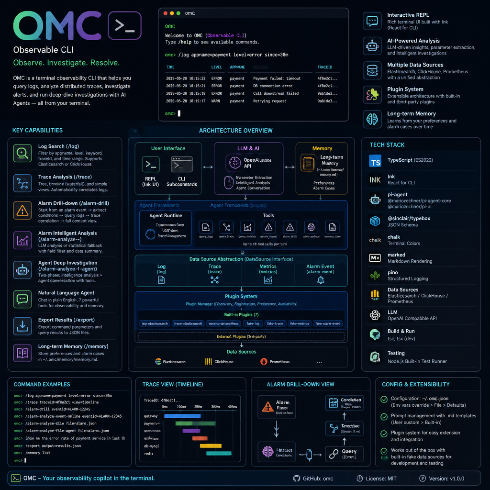

<p align="center">
  
</p>

# OMC — Observability Monitor CLI

A terminal observability tool that supports log search, distributed tracing (Trace) analysis, alarm event intelligent analysis, and Agent-driven deep investigation. Data sources include ClickHouse and Elasticsearch.

## Installation

```bash
npm install -g observable-cli
```

After installation, the `omc` command is available.

## Quick Start

```bash
# Start REPL interactive mode
omc

# Start with arguments (auto-execute then enter REPL)
omc --trace-id abc123
omc -a myapp -L ERROR
omc trace abc123 -v timeline

# Alarm event drill-down (non-interactive, outputs and exits)
omc alarm-drill <eventId>

# Alarm intelligent analysis (non-interactive)
omc alarm-analyze-event-online <eventId>
omc alarm-analyze-file <filePath>

# Agent deep analysis (with conversation loop)
omc alarm-analyze-event-online-agent <eventId>
omc alarm-analyze-file-agent <filePath>

# Metrics query
omc query-metrics 'up{app="myapp"}' --start 1745800000 --end 1745803600
```

In REPL mode, the prompt is `omc>`. Use `/` prefixed commands:

```bash
omc> /log                                # Query all logs
omc> /log -s "timeout" -L ERROR          # Search + level filter
omc> /log --trace-id abc123              # Query by traceId
omc> /trace abc123                       # Trace analysis
omc> /trace abc123 -v timeline           # Timeline view
omc> /alarm-drill <eventId>              # Alarm drill-down (logs + traces)
omc> /alarm-analyze-event-online <eventId>  # Alarm analysis (online)
omc> /alarm-analyze-file <filePath>      # Alarm analysis (from file)
omc> /alarm-analyze-event-online-agent <eventId>  # Agent deep analysis (online)
omc> /alarm-analyze-file-agent <filePath>  # Agent deep analysis (file)
omc> /query-metrics 'up{app="myapp"}'    # Prometheus metrics query
omc> /memory show                         # Show all memories
omc> /memory add preference "Check ERROR first" --content "Always filter ERROR level first" --tags "habits"
omc> /memory add alarm_case "myapp OOM" --content "Root cause: memory leak" --tags "OOM" --appname "myapp"
omc> /export                             # Export last query result to /tmp/omc/
omc> /export ~/my-exports                # Export to specified directory
omc> /help                               # Show help
omc> /quit                               # Exit
```

## Command Reference

### REPL Commands

After starting `omc`, you enter REPL interactive mode with the following commands:

| Command | Description |
|---------|-------------|
| `/alarm-drill <eventId>` | Alarm event drill-down (logs + traces combined view) |
| `/alarm-analyze-event-online <eventId>` | Alarm intelligent analysis (online data collection + LLM analysis) |
| `/alarm-analyze-file <filePath>` | Alarm intelligent analysis (from exported file) |
| `/alarm-analyze-event-online-agent <eventId>` | Agent deep analysis (online collection + Agent conversation) |
| `/alarm-analyze-file-agent <filePath>` | Agent deep analysis (file analysis + Agent conversation) |
| `/query-metrics <PromQL>` | Prometheus metrics query |
| `/memory add\|show\|clean\|backup` | Long-term memory management (requires `memory.enabled`) |
| `/export [dir]` | Export command parameters and results to JSON file |
| `/log [options]` | Query logs (also `/logs`) |
| `/trace <traceId> [options]` | Trace analysis |
| `/help` | Show help |
| `/quit` or `/exit` | Exit program |

#### Log Query `/log`

| Option | Short | Description | Default |
|--------|-------|-------------|---------|
| `--limit <n>` | `-l` | Limit number of results | 200 |
| `--level <level>` | `-L` | Filter by log level (ERROR/WARN/INFO etc.) | - |
| `--search <text>` | `-s` | Search keyword | - |
| `--trace-id <id>` | - | Query by traceId | - |
| `--appname <name>` | `-a` | Filter by application name | - |
| `--start-time <time>` | - | Start time | - |
| `--end-time <time>` | - | End time | - |
| `--query <sql>` | `-q` | Custom SQL query (ClickHouse mode) | - |

#### Trace Analysis `/trace`

| Option | Short | Description | Default |
|--------|-------|-------------|---------|
| `--view <type>` | `-v` | View type: `tree` / `timeline` / `simple` | tree |
| `--limit <n>` | `-l` | Associated log entry limit | 200 |

Three view types:

- **tree** — Hierarchical call relationships, showing parent-child service structure
- **timeline** — Waterfall timeline, showing span duration distribution
- **simple** — Flat list, all spans sorted by time

#### Metrics Query `/query-metrics`

| Option | Description | Default |
|--------|-------------|---------|
| `<PromQL>` | Prometheus query expression | - |
| `--start <time>` | Start time (Unix timestamp) | - |
| `--end <time>` | End time (Unix timestamp) | - |
| `--step <duration>` | Query step | `30s` |
| `--lookback <duration>` | Lookback window | - |

```bash
# Query in REPL
omc> /query-metrics 'up{app="myapp"}' --start 1745800000 --end 1745803600

# Query from command line
omc query-metrics 'up{app="myapp"}'
```

> Requires `pluginsConfig.metrics-prometheus` configuration (`remoteReadUrl` + `clusters` + `namespace`).

#### Alarm Drill-Down `/alarm-drill`

Starting from an alarm event, automatically collects logs and traces:

1. Query alarm event details from the alarm platform
2. Call LLM (OpenAI-compatible API) to extract query conditions:
   - Time range (startTime / endTime)
   - Application name (appname, required; aborts if not found)
   - Pod name (optional)
   - API path (optional)
3. Automatically query logs, extract top 5 distinct traceIds
4. Concurrently query 5 traces, combining call trees + associated logs

```bash
# Use in REPL
/alarm-drill <eventId>

# Use from command line (non-interactive)
omc alarm-drill <eventId>
```

#### Alarm Intelligent Analysis `/alarm-analyze-event-online` / `/alarm-analyze-file`

Performs LLM deep intelligent analysis from an alarm event or exported file:

- **Online analysis** `/alarm-analyze-event-online <eventId>`: Online data collection → LLM analysis
- **File analysis** `/alarm-analyze-file <filePath>`: Analyze from an exported JSON file

Analysis flow:
1. Collect data (online or from JSON file)
2. Route to analyzer via `analysis.mappings`
3. LLM analysis (when analyzer is configured) or statistical analysis (fallback when not configured)
4. Supports field filtering (`fieldFilter`) and data summarization (`summary`)

```bash
# Online analysis
omc> /alarm-analyze-event-online <eventId>

# File analysis
omc> /alarm-analyze-file /tmp/omc/omc-xxx.json

# From command line
omc alarm-analyze-event-online <eventId>
omc alarm-analyze-file <filePath>
```

#### Agent Deep Analysis `/alarm-analyze-event-online-agent` / `/alarm-analyze-file-agent`

Starts an Agent conversation loop for incremental investigation on top of intelligent analysis results:

- **Online Agent** `/alarm-analyze-event-online-agent <eventId>`: Phase1 online collection + LLM analysis → Phase2 Agent deep analysis
- **File Agent** `/alarm-analyze-file-agent <filePath>`: Phase1 file analysis → Phase2 Agent deep analysis

The Agent has 3 tools it can invoke autonomously:
- `query_logs` — Query application logs
- `query_trace` — Query distributed traces
- `query_metrics` — Query Prometheus metrics

```bash
# Online Agent deep analysis
omc> /alarm-analyze-event-online-agent <eventId>

# File Agent deep analysis
omc> /alarm-analyze-file-agent /tmp/omc/omc-xxx.json

# Skip Phase1, load initial prompt from file
omc> /alarm-analyze-file-agent <filePath> --llm-input-file prompt.txt

# From command line
omc alarm-analyze-event-online-agent <eventId>
omc alarm-analyze-file-agent <filePath>
```

After analysis, the Agent enters a conversation loop. Ask questions to continue investigating, type `exit` or `quit` to leave.

> Requires `agentModel` configuration (see Configuration section).

#### Default Agent (Natural Language Interaction)

When `defaultAgent.enabled = true` is configured, entering natural language (without `/` prefix) in REPL is routed to the default Agent, serving as an intelligent observability assistant.

```bash
omc> Check recent error logs for myapp
omc> eventId abc123, analyze this alarm for me
omc> What's wrong with traceId xyz789
```

The default Agent provides 7 tools (6 without `memory.enabled`): `query_logs`, `query_trace`, `query_metrics`, `query_alarm_event`, `alarm_drill`, `alarm_analyze`, `memory_save`.

- The Agent is created at REPL startup, persists throughout the session, and maintains conversation context
- Relationship with dedicated Agents: when a dedicated Agent (`/alarm-analyze-*-agent`) is active, it takes priority; after it finishes, the default Agent resumes automatically
- When `memory.enabled` is on, the Agent auto-loads existing memories into the system prompt
- `/` prefixed commands still use the original routing; type `exit` / `quit` to exit REPL

> Requires `defaultAgent` configuration (see Configuration section).

#### Result Export `/export`

After executing a query command, use `/export` to save command parameters and query results as a JSON file:

```bash
# Export to default directory /tmp/omc/
omc> /log -a myapp -L ERROR
  ... (view results)
omc> /export
  Exported to: /tmp/omc/omc-1745800000000-a1b2c3d4.json

# Export to specified directory
omc> /export ~/my-exports
  Exported to: ~/my-exports/omc-1745800000000-a1b2c3d4.json
```

Export file format:

```json
{
  "command": "/log -a myapp -L ERROR",
  "timestamp": "2026-04-28T12:00:00.000Z",
  "params": { "command": "/log -a myapp -L ERROR", "appname": "myapp", "level": "ERROR" },
  "results": { "queryInfo": "Source: ES", "logSource": "es", "logs": [...] }
}
```

Supports export for all query commands (`/log`, `/trace`, `/alarm-drill`, `/alert`). Press `q` to return to REPL after viewing results, then run `/export`.

#### Long-Term Memory `/memory`

Records user preferences and alarm investigation cases for cross-session Agent reference. Requires `memory.enabled = true`.

**Two memory types**:

| Type | Identifier | Purpose | Example |
|------|-----------|---------|---------|
| User Preference | `preference` | Investigation habits, preferences | "Always check ERROR logs first" |
| Alarm Case | `alarm_case` | Alarm events and investigation results | "myapp OOM alarm, root cause: memory leak" |

```bash
# Add preference
omc> /memory add preference "Check ERROR first" --content "Always filter ERROR level first" --tags "habits"

# Add alarm case
omc> /memory add alarm_case "myapp OOM" --content "Root cause: memory leak, restarted" --tags "OOM" --appname "myapp"

# Show all memories
omc> /memory show

# Clear memories (auto-backup)
omc> /memory clean

# Manual backup
omc> /memory backup before-clean
```

**Storage location**: `~/.omc/memory/memory.md` (Markdown format)

**Agent integration**: When enabled, the default Agent auto-loads existing memories and can proactively save memories via the `memory_save` tool.

### Command Line Arguments

You can also start directly with command line arguments, which auto-execute then enter REPL:

```bash
# Log query mode
omc [options]
  -l, --limit <n>       Limit results (default 200)
  -L, --level <level>   Filter by log level
  -s, --search <text>   Search keyword
  --trace-id <id>       Query by traceId
  -a, --appname <name>  Filter by application name
  --start-time <time>   Start time
  --end-time <time>     End time
  -q, --query <sql>     Custom SQL query
  -c, --config <path>   Specify config file

# Trace analysis mode
omc trace <traceId> [options]
  -v, --view <type>     View type: tree | timeline | simple
  -l, --limit <n>       Associated log entry limit

# Alarm event drill-down (non-interactive)
omc alarm-drill <eventId>

# Alarm intelligent analysis (non-interactive)
omc alarm-analyze-event-online <eventId>    Online collection + LLM analysis
omc alarm-analyze-file <filePath>           Analyze from file

# Agent deep analysis (non-interactive, with conversation loop)
omc alarm-analyze-event-online-agent <eventId> [--llm-input-file <path>]
omc alarm-analyze-file-agent <filePath> [--llm-input-file <path>]

# Prometheus metrics query
omc query-metrics <PromQL> [--start <time>] [--end <time>] [--step <duration>] [--lookback <duration>]
```

## Keyboard Shortcuts

### REPL Mode

After starting, you enter the `omc>` interactive prompt:

| Key | Action |
|-----|--------|
| `↑` / `↓` | Navigate command history |
| `Enter` | Execute command |
| `Backspace` | Delete character |
| `Ctrl+C` | Exit program |

### Log/Trace View

| Key | Action |
|-----|--------|
| `/` | Enter search mode |
| `j` / `↓` | Move down |
| `k` / `↑` | Move up |
| `g` | Jump to first entry |
| `G` | Jump to last entry |
| `Ctrl+e` | Scroll down one line |
| `Ctrl+y` | Scroll up one line |
| `q` / `Esc` | Return to REPL |
| `v` | Cycle trace view (tree → timeline → simple) |

### Alarm Analysis View

| Key | Action |
|-----|--------|
| `j` / `↓` | Scroll down |
| `k` / `↑` | Scroll up |
| `Ctrl+e` | Scroll down one line |
| `Ctrl+y` | Scroll up one line |
| `g` | Jump to top |
| `G` | Jump to bottom |
| `q` / `Esc` | Return to REPL |

### Search Mode

Press `/` to enter search mode:

- Type keywords to filter in real-time
- `Enter` to confirm search and exit search mode
- `Esc` to cancel search and restore all results
- `Backspace` to delete last character

## Configuration

The configuration file is located at `~/.omc.json`, or specify a path via `-c`. Environment variables override the config file. Priority: **environment variables > config file > defaults**.

### Configuration Example

```json
{
  "clickhouseUrl": "http://localhost:8123",
  "database": "default",
  "table": "logs",
  "username": "default",
  "password": "",
  "traceIdField": "traceid",
  "logSource": "es",
  "pluginsConfig": {
    "trace-elasticsearch": {
      "host": "http://<your-es-host>:9200",
      "indexPattern": "jaeger-span-*",
      "username": "<your-es-username>",
      "password": "<your-es-password>"
    },
    "log-elasticsearch": {
      "host": "http://<your-es-host>:9200",
      "indexPattern": "log-*",
      "traceIdField": "traceId",
      "timestampField": "@timestamp",
      "username": "<your-es-username>",
      "password": "<your-es-password>"
    },
    "metrics-prometheus": {
      "remoteReadUrl": "http://localhost:9090",
      "clusters": ["my-cluster"],
      "namespace": "my-namespace",
      "rateInterval": "2m",
      "step": "30s",
      "timeRangeMinutes": 30
    }
  },
  "extractorModel": {
    "baseUrl": "https://<your-llm-api>/v1",
    "token": "<your-api-key>",
    "model": "model-name"
  },
  "agentModel": {
    "baseUrl": "https://<your-llm-api>/v1",
    "token": "<your-api-key>",
    "model": "model-name",
    "api": "openai-completions",
    "maxTokens": 4096,
    "contextWindow": 128000
  },
  "defaultAgent": {
    "enabled": true,
    "maxToolCalls": 10,
    "baseUrl": "https://<your-llm-api>/v1",
    "token": "<your-api-key>",
    "model": "model-name",
    "api": "openai-completions",
    "maxTokens": 4096,
    "contextWindow": 128000
  },
  "memory": {
    "enabled": true,
    "maxEntriesPerType": 20,
    "maxCharsPerType": 10000
  },
  "analysis": {
    "models": {
      "default": {
        "baseUrl": "https://your-llm-api/v1",
        "token": "your-api-key",
        "model": "model-name"
      }
    },
    "analyzers": {
      "sre": {
        "model": "default",
        "prompt": "sre-deep"
      }
    },
    "mappings": [
      {
        "apps": ["myapp"],
        "analyzer": "sre",
        "context": "myapp-context"
      }
    ],
    "fieldFilter": {
      "logFields": ["timestamp", "level", "message", "traceId"],
      "spanFields": ["operationName", "serviceName", "durationMs"],
      "maxDataChars": 80000
    },
    "summary": {
      "enabled": true,
      "model": "default",
      "chunkSize": 20000,
      "targetSize": 4000
    }
  }
}
```

### Configuration Reference

#### ClickHouse

| Field | Description | Default |
|-------|-------------|---------|
| `clickhouseUrl` | ClickHouse URL | `http://localhost:8123` |
| `database` | Database name | `default` |
| `table` | Table name | `logs` |
| `username` | Username | - |
| `password` | Password | - |
| `traceIdField` | traceId field name | - |

#### Elasticsearch

| Field | Description |
|-------|-------------|
| `pluginsConfig.trace-elasticsearch.host` | Trace ES host |
| `pluginsConfig.trace-elasticsearch.indexPattern` | Trace ES index pattern |
| `pluginsConfig.log-elasticsearch.host` | Log ES host |
| `pluginsConfig.log-elasticsearch.indexPattern` | Log ES index pattern |
| `pluginsConfig.log-elasticsearch.traceIdField` | traceId field name in log ES |
| `pluginsConfig.log-elasticsearch.timestampField` | Timestamp field name in log ES |
| `pluginsConfig.log-elasticsearch.fieldMapping` | ES field mapping (appname/level/podname/uri etc.) |

#### Data Source Selection

| Field | Description | Options | Default |
|-------|-------------|---------|---------|
| `logSource` | Log data source | `clickhouse` / `es` | `clickhouse` |
| `trace.source` | Trace associated log data source | `clickhouse` / `es` / `none` | `clickhouse` |

#### Prometheus Metrics

| Field | Description | Default |
|-------|-------------|---------|
| `pluginsConfig.metrics-prometheus.remoteReadUrl` | Prometheus API URL | - |
| `pluginsConfig.metrics-prometheus.clusters` | Cluster list | - |
| `pluginsConfig.metrics-prometheus.namespace` | Namespace | - |
| `pluginsConfig.metrics-prometheus.rateInterval` | Rate window | `2m` |
| `pluginsConfig.metrics-prometheus.step` | Query step | `30s` |
| `pluginsConfig.metrics-prometheus.timeRangeMinutes` | Time window (minutes) | `30` |

#### LLM Parameter Extraction Model

| Field | Description | Default |
|-------|-------------|---------|
| `extractorModel.baseUrl` | LLM API URL (OpenAI-compatible) | - |
| `extractorModel.token` | API Key | - |
| `extractorModel.model` | Model name | - |

#### Agent Model

| Field | Description | Default |
|-------|-------------|---------|
| `agentModel.baseUrl` | LLM API URL (OpenAI-compatible) | - |
| `agentModel.token` | API Key | - |
| `agentModel.model` | Model name | - |
| `agentModel.api` | API type | `openai-completions` |
| `agentModel.maxTokens` | Max tokens | `4096` |
| `agentModel.contextWindow` | Context window size | `128000` |

#### Default Agent

| Field | Description | Default |
|-------|-------------|---------|
| `defaultAgent.enabled` | Enable default Agent | `false` |
| `defaultAgent.maxToolCalls` | Max tool calls per conversation turn | `10` |
| `defaultAgent.baseUrl` | LLM API URL (OpenAI-compatible) | - |
| `defaultAgent.token` | API Key | - |
| `defaultAgent.model` | Model name | - |
| `defaultAgent.api` | API type | `openai-completions` |
| `defaultAgent.maxTokens` | Max tokens | `4096` |
| `defaultAgent.contextWindow` | Context window size | `128000` |

#### Long-Term Memory

| Field | Description | Default |
|-------|-------------|---------|
| `memory.enabled` | Enable long-term memory | `false` |
| `memory.maxEntriesPerType` | Max entries per type (oldest trimmed when exceeded) | `20` |
| `memory.maxCharsPerType` | Max characters per type (oldest trimmed when exceeded) | `10000` |

#### Alarm Intelligent Analysis

| Field | Description |
|-------|-------------|
| `analysis.models` | Analysis model definitions (key → {baseUrl, token, model}) |
| `analysis.analyzers` | Analyzer definitions (key → {model, prompt, temperature}) |
| `analysis.mappings` | appname → analyzer + context routing mappings |
| `analysis.fieldFilter.logFields` | Log field whitelist (optional, uses default filter if not set) |
| `analysis.fieldFilter.spanFields` | Span field whitelist (optional, uses default filter if not set) |
| `analysis.fieldFilter.maxDataChars` | Max total data characters | `80000` |
| `analysis.summary.enabled` | Enable LLM summarization | `false` |
| `analysis.summary.model` | Summary model reference | Reuses analyzer model |
| `analysis.summary.chunkSize` | Max characters per chunk | `20000` |
| `analysis.summary.targetSize` | Target summary character count | `4000` |

**fieldFilter default fields** (when `logFields` / `spanFields` are not configured):

| Data Type | Default Fields | Notes |
|-----------|---------------|-------|
| Log | `timestamp`, `level`, `appname`, `traceId`, `message` | message truncated to 500 chars |
| Span | `operationName`, `serviceName`, `durationMs`, `hasError` | No truncation |

Configuration modes:
- `logFields` / `spanFields` not configured → use default filter above
- `logFields: ["*"]` / `spanFields: ["*"]` → keep all fields, no truncation
- `logFields: ["field1", "field2"]` → extract specified fields, no truncation

### Environment Variables

All configuration items can be set via environment variables:

```bash
# ClickHouse
MONITOR_CLICKHOUSE_URL="http://localhost:8123"
MONITOR_DATABASE="default"
MONITOR_TABLE="logs"
MONITOR_TRACE_ID_FIELD="traceid"

# Trace ES
TRACE_ES_HOST="http://es-host:9200"
TRACE_ES_INDEX_PATTERN="jaeger-span-*"
TRACE_ES_USERNAME="user"
TRACE_ES_PASSWORD="pass"

# Log ES
LOG_ES_HOST="http://es-host:9200"
LOG_ES_INDEX_PATTERN="log-*"
LOG_ES_TRACE_ID_FIELD="traceId"
LOG_ES_TIMESTAMP_FIELD="@timestamp"
LOG_ES_USERNAME="user"
LOG_ES_PASSWORD="pass"

# Data source selection
MONITOR_LOG_SOURCE="es"
MONITOR_TRACE_LOG_SOURCE="es"

# Prometheus metrics
PROMETHEUS_REMOTE_READ_URL="http://localhost:9090"
PROMETHEUS_CLUSTERS="my-cluster"
PROMETHEUS_NAMESPACE="my-namespace"
PROMETHEUS_RATE_INTERVAL="2m"
PROMETHEUS_STEP="30s"

# Parameter extraction model
EXTRACTOR_MODEL_BASE_URL="https://your-llm-api/v1"
EXTRACTOR_MODEL_TOKEN="your-api-key"
EXTRACTOR_MODEL_NAME="model-name"

# Agent model
AGENT_MODEL_BASE_URL="https://your-llm-api/v1"
AGENT_MODEL_TOKEN="your-api-key"
AGENT_MODEL_NAME="model-name"
AGENT_MODEL_API="openai-completions"

# Default Agent
DEFAULT_AGENT_BASE_URL="https://your-llm-api/v1"
DEFAULT_AGENT_TOKEN="your-api-key"
DEFAULT_AGENT_MODEL="model-name"

# Long-term memory
MONITOR_MEMORY_ENABLED="true"
MONITOR_MEMORY_MAX_ENTRIES="20"
MONITOR_MEMORY_MAX_CHARS="10000"

# Debug switch
OMC_DEBUG=1    # Enable LLM request debug logs + Agent payload logs + /alert command
```

## Prompt Management

All LLM prompts are stored as `.md` files in the `src/prompts/` directory, allowing independent iteration without code changes.

### Loading Priority

1. **User custom** `~/.omc/prompts/<name>.md` — Highest priority, can override any built-in prompt
2. **Built-in** `src/prompts/<name>.md` — Default version shipped with the package

### Prompt Files

| File | Purpose |
|------|---------|
| `extract-params.md` | Extract query conditions from alarm event JSON (appname, podname, apiPath etc.) |
| `summary-system.md` | System prompt for log/trace incremental summarization |
| `summary-user.md` | User template for log/trace incremental summarization |
| `summary-refine.md` | Second-round refinement prompt when summary exceeds limit |
| `metrics-summary-system.md` | System prompt for Prometheus metrics incremental summarization |
| `metrics-summary-user.md` | User template for Prometheus metrics incremental summarization |
| `metrics-summary-refine.md` | Second-round refinement prompt for metrics summary |
| `sre-deep.md` | SRE deep analysis prompt (default analysis template) |
| `agent-sre-deep.md` | Agent deep analysis system prompt (tool usage guidelines + conversation norms) |
| `default-agent.md` | Default Agent system prompt (observability assistant + scenario flows + tool descriptions) |

### Template Variables

Prompt files use `{{variable}}` template variables, replaced at runtime:

| Variable | Description | Used In |
|----------|-------------|---------|
| `{{data}}` | Analysis data (JSON or summary text) | `sre-deep.md` |
| `{{context}}` | Additional context knowledge | `sre-deep.md` |
| `{{previousSummary}}` | Previous round summary result | `summary-user.md`, `metrics-summary-user.md` |
| `{{chunk}}` | Current chunk of new data | `summary-user.md`, `metrics-summary-user.md` |
| `{{currentSummary}}` | Summary content to be refined | `summary-refine.md`, `metrics-summary-refine.md` |
| `{{targetSize}}` | Target character count for refinement | `summary-refine.md`, `metrics-summary-refine.md` |

### Custom Prompts

Create a `.md` file with the same name under `~/.omc/prompts/` to override the built-in version:

```bash
mkdir -p ~/.omc/prompts
cp prompts/extract-params.md ~/.omc/prompts/extract-params.md
# Edit your custom version
vim ~/.omc/prompts/extract-params.md
```

Analysis prompts can also be specified via the `analysis.analyzers.<name>.prompt` field in configuration (without `.md` suffix).

## Development

```bash
# Install dependencies
npm install

# Run in development mode
npm run dev -- [options]

# Build
npm run build

# Run in production mode
npm start -- [options]

# Run tests
npm test

# Publish
npm publish
```

## Tech Stack

- TypeScript
- [Ink](https://github.com/vadimdemedes/ink) — React for CLI
- [pi-agent](https://github.com/mariozechner/pi-agent) — Agent runtime framework (tool invocation + conversation loop)
- [@sinclair/typebox](https://github.com/sinclairzx81/typebox) — Agent tool parameter Schema
- [chalk](https://github.com/chalk/chalk) — Terminal ANSI colors
- [marked](https://github.com/markedjs/marked) — Markdown parsing (terminal rendering)
- [pino](https://github.com/pinojs/pino) — Structured logging (enabled when OMC_DEBUG=1)
- ClickHouse / Elasticsearch
- OpenAI-compatible LLM API (parameter extraction + intelligent analysis + Agent conversation)
